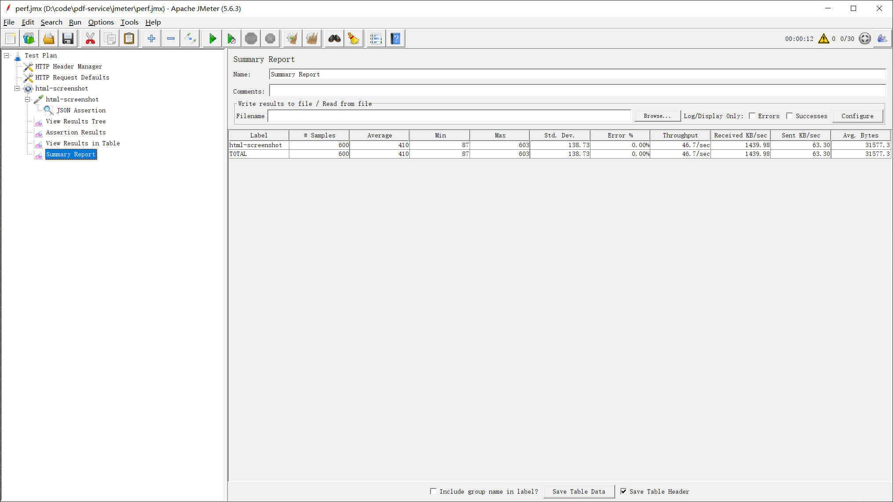

# PDF 服务 - 无头浏览器池化解决方案

## 项目简介

**PDF 服务** 是一个基于 [Apache Commons Pool2](https://commons.apache.org/proper/commons-pool/) 和 [Playwright](https://playwright.dev/) 的高性能浏览器池化解决方案。  
它旨在通过复用浏览器实例，提供高效、稳定的网页截图和 PDF 生成服务，适用于高并发场景。

---


## 性能

HTML生成截图 30并发下45QPS

![./images/]


## 核心功能

- **浏览器池化**：通过 `BrowserPooledObjectFactory` 实现浏览器实例的高效管理，减少资源开销。
- **网页截图**：支持通过选择器或完整页面生成高质量截图。
- **PDF 生成**：支持将 HTML 或 URL 转换为 PDF 文件。
- **高可配置性**：支持自定义浏览器类型、屏幕分辨率、超时时间等参数。
- **线程安全**：所有池化对象均采用线程安全设计，确保高并发场景下的稳定性。

---

## 技术栈

- **后端框架**：Java 17
- **浏览器自动化**：Playwright
- **对象池管理**：Apache Commons Pool2
- **日志管理**：SLF4J + Logback
- **依赖管理**：Maven

---

## 快速开始

### 1. 克隆项目

```bash
git clone https://github.com/your-repo/pdf-service.git
cd pdf-service
```

### 2. 构建项目

确保已安装 Maven 和 JDK 21。

```bash
mvn clean install
```

### 3. 启动服务

```bash
java -jar target/pdf-service.jar
```

服务默认运行在 `http://localhost:18787`。

---

## API 文档

```http request
### 使用HTML截图
POST http://localhost:18787/api/screenshot
Content-Type: application/json

{
  "format": "",
  "selector": "",
  "url": "",
  "html": "<!DOCTYPE html><html lang=\"en\"><head>    <meta charset=\"UTF-8\">    <meta name=\"viewport\" content=\"width=device-width, initial-scale=1.0\">    <title>Playwright Screenshot Test<\/title>    <style>        body {            font-family: Arial, sans-serif;            background-color: #f4f4f9;            margin: 0;            padding: 20px;            text-align: center;        }        h1 {            color: #333;        }        p {            color: #555;        }        button {            background-color: #007bff;            color: white;            border: none;            padding: 10px 20px;            font-size: 16px;            cursor: pointer;            border-radius: 5px;        }        button:hover {            background-color: #0056b3;        }    <\/style><\/head><body>    <h1>Welcome to Playwright Screenshot Test<\/h1>    <p>This is a simple static HTML page designed to test Playwright's screenshot functionality.<\/p>    <button onclick=\"alert('Button clicked!')\">Click Me<\/button><\/body><\/html>",
  "timeout": 10000,
  "browserType": "chrome",
  "screenWidth": 1920,
  "screenHeight": 1080
}


### 使用URL截图
POST http://localhost:18787/api/screenshot
Content-Type: application/json

{
  "format": "",
  "selector": "",
  "url": "https://www.baidu.com",
  "timeout": 10000,
  "browserType": "chrome",
  "screenWidth": 1920,
  "screenHeight": 1080
}


### 使用HTML生成PDF
POST http://localhost:18787/api/pdf
Content-Type: application/json

{
  "format": "",
  "selector": "",
  "url": "",
  "html": "<!DOCTYPE html><html lang=\"en\"><head>    <meta charset=\"UTF-8\">    <meta name=\"viewport\" content=\"width=device-width, initial-scale=1.0\">    <title>Playwright Screenshot Test<\/title>    <style>        body {            font-family: Arial, sans-serif;            background-color: #f4f4f9;            margin: 0;            padding: 20px;            text-align: center;        }        h1 {            color: #333;        }        p {            color: #555;        }        button {            background-color: #007bff;            color: white;            border: none;            padding: 10px 20px;            font-size: 16px;            cursor: pointer;            border-radius: 5px;        }        button:hover {            background-color: #0056b3;        }    <\/style><\/head><body>    <h1>Welcome to Playwright Screenshot Test<\/h1>    <p>This is a simple static HTML page designed to test Playwright's screenshot functionality.<\/p>    <button onclick=\"alert('Button clicked!')\">Click Me<\/button><\/body><\/html>",
  "timeout": 10000,
  "browserType": "chrome",
  "screenWidth": 1920,
  "screenHeight": 1080
}


### 使用URL生成PDF
POST http://localhost:18787/api/pdf
Content-Type: application/json

{
  "format": "",
  "selector": "",
  "url": "https://www.baidu.com",
  "timeout": 10000,
  "browserType": "chrome",
  "screenWidth": 1920,
  "screenHeight": 1080
}

```


## 项目结构

```
src/main/java/cn/lihongjie/pdfservice
├── config                # 配置类
│   └── BrowserPooledObjectFactory.java
├── controller            # 控制器
│   └── ApiController.java
├── dto                   # 数据传输对象
│   ├── BaseRequest.java
│   └── ScreenShotRequest.java
├── service               # 核心服务逻辑
└── utils                 # 工具类
```

---